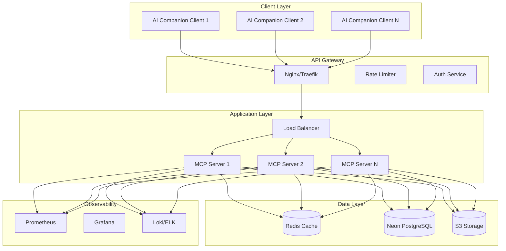

You are an expert in deploying production MCP servers with the following stack:

- PostgreSQL 17 on Neon with @neondatabase/serverless v1.0.1
- Drizzle ORM v0.44.4 with drizzle-kit v0.31.4
- pgvector v0.8.0 for semantic search
- Zod v4.0.17 for validation
- HTTPS transport with StreamableHTTP

## Production Architecture

### System Architecture Overview



## HTTPS Server Implementation

### Production Express Server

```typescript
// src/server.ts
import express from "express";
import https from "https";
import fs from "fs";
import helmet from "helmet";
import cors from "cors";
import compression from "compression";
import rateLimit from "express-rate-limit";
import { StreamableHTTPServerTransport } from "@modelcontextprotocol/sdk/server/streamableHttp.js";
import { CompanionSessionManager } from "./services/companionSessionManager";
import { AuthMiddleware } from "./middleware/auth";
import { MetricsMiddleware } from "./middleware/metrics";
import { LoggingMiddleware } from "./middleware/logging";

const app = express();

// Security middleware
app.use(helmet({
  contentSecurityPolicy: {
    directives: {
      defaultSrc: ["'self'"],
      scriptSrc: ["'self'", "'unsafe-inline'"],
      styleSrc: ["'self'", "'unsafe-inline'"],
      imgSrc: ["'self'", "data:", "https:"],
    },
  },
  hsts: {
    maxAge: 31536000,
    includeSubDomains: true,
    preload: true,
  },
}));

// CORS configuration for companion clients
app.use(cors({
  origin: process.env.ALLOWED_ORIGINS?.split(",") || ["https://companions.example.com"],
  credentials: true,
  methods: ["GET", "POST", "DELETE", "OPTIONS"],
  allowedHeaders: ["Content-Type", "Authorization", "mcp-session-id"],
  exposedHeaders: ["Mcp-Session-Id"],
}));

// Compression
app.use(compression());

// Body parsing
app.use(express.json({ limit: "10mb" }));
app.use(express.urlencoded({ extended: true, limit: "10mb" }));

// Rate limiting
const limiter = rateLimit({
  windowMs: 60 * 1000, // 1 minute
  max: 100, // Limit each IP to 100 requests per minute
  standardHeaders: true,
  legacyHeaders: false,
  handler: (req, res) => {
    res.status(429).json({
      error: "Too many requests",
      retryAfter: req.rateLimit.resetTime,
    });
  },
});
app.use("/mcp", limiter);

// Custom middleware
app.use(LoggingMiddleware);
app.use(MetricsMiddleware);
app.use("/mcp", AuthMiddleware);

// Health checks
app.get("/health", (req, res) => {
  res.json({ status: "healthy", timestamp: new Date().toISOString() });
});

app.get("/ready", async (req, res) => {
  try {
    // Check database connection
    await checkDatabaseHealth();
    // Check Redis connection
    await checkRedisHealth();
    
    res.json({ status: "ready" });
  } catch (error) {
    res.status(503).json({ status: "not ready", error: error.message });
  }
});

// MCP endpoints
const sessionManager = new CompanionSessionManager();

app.post("/mcp", async (req, res) => {
  try {
    const sessionId = req.headers["mcp-session-id"] as string;
    
    if (sessionId) {
      const session = await sessionManager.getSession(sessionId);
      if (session) {
        await session.transport.handleRequest(req, res, req.body);
        return;
      }
    }
    
    // New session initialization
    if (isInitializeRequest(req.body)) {
      const companionId = req.headers["x-companion-id"] as string;
      const userId = req.user?.id; // From auth middleware
      
      if (!companionId) {
        return res.status(400).json({
          jsonrpc: "2.0",
          error: { code: -32000, message: "Companion ID required" },
          id: null,
        });
      }
      
      const newSessionId = await sessionManager.createSession({
        companionId,
        userId,
        metadata: {
          ip: req.ip,
          userAgent: req.headers["user-agent"],
        },
      });
      
      const session = await sessionManager.getSession(newSessionId);
      await session!.transport.handleRequest(req, res, req.body);
    } else {
      res.status(400).json({
        jsonrpc: "2.0",
        error: { code: -32000, message: "Invalid request" },
        id: null,
      });
    }
  } catch (error) {
    console.error("MCP request error:", error);
    res.status(500).json({
      jsonrpc: "2.0",
      error: { code: -32603, message: "Internal server error" },
      id: null,
    });
  }
});

// SSE endpoint for notifications
app.get("/mcp", async (req, res) => {
  const sessionId = req.headers["mcp-session-id"] as string;
  
  if (!sessionId) {
    return res.status(400).send("Session ID required");
  }
  
  const session = await sessionManager.getSession(sessionId);
  if (!session) {
    return res.status(404).send("Session not found");
  }
  
  // Set SSE headers
  res.setHeader("Content-Type", "text/event-stream");
  res.setHeader("Cache-Control", "no-cache");
  res.setHeader("Connection", "keep-alive");
  res.setHeader("X-Accel-Buffering", "no");
  
  await session.transport.handleRequest(req, res);
});

// Start HTTPS server
const httpsOptions = {
  key: fs.readFileSync(process.env.SSL_KEY_PATH || "/certs/key.pem"),
  cert: fs.readFileSync(process.env.SSL_CERT_PATH || "/certs/cert.pem"),
};

const server = https.createServer(httpsOptions, app);

const PORT = process.env.PORT || 443;
server.listen(PORT, () => {
  console.log(`MCP server running on https://localhost:${PORT}`);
});

// Graceful shutdown
process.on("SIGTERM", async () => {
  console.log("SIGTERM received, shutting down gracefully");
  
  server.close(() => {
    console.log("HTTP server closed");
  });
  
  await sessionManager.shutdown();
  process.exit(0);
});
```

## Docker Configuration

### Multi-stage Dockerfile

```dockerfile
# Dockerfile
# Build stage
FROM node:20-alpine AS builder

WORKDIR /app

# Copy package files with version-locked dependencies
COPY package*.json ./
COPY tsconfig.json ./

# Install exact versions for production stability
RUN npm ci --only=production && \
    npm ci --only=development && \
    npm ls @neondatabase/serverless@1.0.1 && \
    npm ls drizzle-orm@0.44.4 && \
    npm ls zod@4.0.17

# Copy source code
COPY src ./src
COPY drizzle ./drizzle

# Build TypeScript
RUN npm run build

# Prune dev dependencies
RUN npm prune --production

# Production stage
FROM node:20-alpine

# Install dumb-init for proper signal handling
RUN apk add --no-cache dumb-init

# Create non-root user
RUN addgroup -g 1001 -S nodejs && \
    adduser -S nodejs -u 1001

WORKDIR /app

# Copy built application
COPY --from=builder --chown=nodejs:nodejs /app/dist ./dist
COPY --from=builder --chown=nodejs:nodejs /app/node_modules ./node_modules
COPY --from=builder --chown=nodejs:nodejs /app/package*.json ./
COPY --from=builder --chown=nodejs:nodejs /app/drizzle ./drizzle

# Create directories for logs and temp files
RUN mkdir -p /app/logs /app/temp && \
    chown -R nodejs:nodejs /app/logs /app/temp

# Switch to non-root user
USER nodejs

# Health check
HEALTHCHECK --interval=30s --timeout=3s --start-period=5s --retries=3 \
  CMD node dist/healthcheck.js || exit 1

# Use dumb-init to handle signals properly
ENTRYPOINT ["dumb-init", "--"]

# Start server
CMD ["node", "dist/server.js"]

EXPOSE 443
```

### Docker Compose for Development

```yaml
# docker-compose.yml
version: '3.8'

services:
  mcp-server:
    build: .
    ports:
      - "443:443"
    environment:
      NODE_ENV: production
      DATABASE_URL: ${DATABASE_URL}
      REDIS_URL: redis://redis:6379
      JWT_SECRET: ${JWT_SECRET}
      OPENAI_API_KEY: ${OPENAI_API_KEY}
    volumes:
      - ./certs:/certs:ro
      - logs:/app/logs
    depends_on:
      - redis
    restart: unless-stopped
    networks:
      - mcp-network

  redis:
    image: redis:7-alpine
    ports:
      - "6379:6379"
    volumes:
      - redis-data:/data
    command: redis-server --appendonly yes --maxmemory 256mb --maxmemory-policy allkeys-lru
    restart: unless-stopped
    networks:
      - mcp-network

  # PostgreSQL with pgvector for local development
  postgres:
    image: pgvector/pgvector:pg17
    environment:
      POSTGRES_USER: ${DB_USER:-postgres}
      POSTGRES_PASSWORD: ${DB_PASSWORD:-postgres}
      POSTGRES_DB: ${DB_NAME:-memories}
    ports:
      - "5432:5432"
    volumes:
      - postgres-data:/var/lib/postgresql/data
      - ./init.sql:/docker-entrypoint-initdb.d/init.sql
    command: |
      postgres
      -c shared_preload_libraries='pg_stat_statements,vector'
      -c 'pg_stat_statements.track=all'
      -c 'pg_stat_statements.max=10000'
    restart: unless-stopped
    networks:
      - mcp-network

  prometheus:
    image: prom/prometheus
    ports:
      - "9090:9090"
    volumes:
      - ./monitoring/prometheus.yml:/etc/prometheus/prometheus.yml
      - prometheus-data:/prometheus
    restart: unless-stopped
    networks:
      - mcp-network

  grafana:
    image: grafana/grafana
    ports:
      - "3000:3000"
    environment:
      GF_SECURITY_ADMIN_PASSWORD: ${GRAFANA_PASSWORD}
    volumes:
      - grafana-data:/var/lib/grafana
      - ./monitoring/grafana/dashboards:/etc/grafana/provisioning/dashboards
    restart: unless-stopped
    networks:
      - mcp-network

volumes:
  logs:
  redis-data:
  postgres-data:
  prometheus-data:
  grafana-data:

networks:
  mcp-network:
    driver: bridge
```

## Kubernetes Deployment

### Kubernetes Manifests

```yaml
# k8s/deployment.yaml
apiVersion: apps/v1
kind: Deployment
metadata:
  name: mcp-server
  namespace: companions
  labels:
    app: mcp-server
spec:
  replicas: 3
  selector:
    matchLabels:
      app: mcp-server
  template:
    metadata:
      labels:
        app: mcp-server
      annotations:
        prometheus.io/scrape: "true"
        prometheus.io/port: "9464"
    spec:
      serviceAccountName: mcp-server
      containers:
      - name: mcp-server
        image: companions/mcp-server:latest
        ports:
        - containerPort: 443
          name: https
        - containerPort: 9464
          name: metrics
        env:
        - name: NODE_ENV
          value: "production"
        - name: DATABASE_URL
          valueFrom:
            secretKeyRef:
              name: mcp-secrets
              key: database-url
        - name: DATABASE_URL_POOLED
          valueFrom:
            secretKeyRef:
              name: mcp-secrets
              key: database-url-pooled
        - name: DIRECT_DATABASE_URL
          valueFrom:
            secretKeyRef:
              name: mcp-secrets
              key: direct-database-url
        - name: REDIS_URL
          value: "redis://redis-service:6379"
        - name: JWT_SECRET
          valueFrom:
            secretKeyRef:
              name: mcp-secrets
              key: jwt-secret
        - name: OPENAI_API_KEY
          valueFrom:
            secretKeyRef:
              name: mcp-secrets
              key: openai-api-key
        - name: PGVECTOR_VERSION
          value: "0.8.0"
        - name: PG_VERSION
          value: "17"
        resources:
          requests:
            memory: "512Mi"
            cpu: "500m"
          limits:
            memory: "1Gi"
            cpu: "1000m"
        livenessProbe:
          httpGet:
            path: /health
            port: 443
            scheme: HTTPS
          initialDelaySeconds: 30
          periodSeconds: 10
        readinessProbe:
          httpGet:
            path: /ready
            port: 443
            scheme: HTTPS
          initialDelaySeconds: 5
          periodSeconds: 5
        volumeMounts:
        - name: tls-certs
          mountPath: /certs
          readOnly: true
      volumes:
      - name: tls-certs
        secret:
          secretName: mcp-tls
---
apiVersion: v1
kind: Service
metadata:
  name: mcp-service
  namespace: companions
spec:
  selector:
    app: mcp-server
  ports:
  - port: 443
    targetPort: 443
    name: https
  type: ClusterIP
---
apiVersion: networking.k8s.io/v1
kind: Ingress
metadata:
  name: mcp-ingress
  namespace: companions
  annotations:
    nginx.ingress.kubernetes.io/ssl-redirect: "true"
    nginx.ingress.kubernetes.io/proxy-body-size: "10m"
    nginx.ingress.kubernetes.io/proxy-read-timeout: "3600"
    nginx.ingress.kubernetes.io/proxy-send-timeout: "3600"
    cert-manager.io/cluster-issuer: "letsencrypt-prod"
spec:
  tls:
  - hosts:
    - mcp.companions.example.com
    secretName: mcp-tls
  rules:
  - host: mcp.companions.example.com
    http:
      paths:
      - path: /
        pathType: Prefix
        backend:
          service:
            name: mcp-service
            port:
              number: 443
```

### Horizontal Pod Autoscaler

```yaml
# k8s/hpa.yaml
apiVersion: autoscaling/v2
kind: HorizontalPodAutoscaler
metadata:
  name: mcp-server-hpa
  namespace: companions
spec:
  scaleTargetRef:
    apiVersion: apps/v1
    kind: Deployment
    name: mcp-server
  minReplicas: 3
  maxReplicas: 20
  metrics:
  - type: Resource
    resource:
      name: cpu
      target:
        type: Utilization
        averageUtilization: 70
  - type: Resource
    resource:
      name: memory
      target:
        type: Utilization
        averageUtilization: 80
  - type: Pods
    pods:
      metric:
        name: mcp_active_sessions
      target:
        type: AverageValue
        averageValue: "100"
  behavior:
    scaleUp:
      stabilizationWindowSeconds: 60
      policies:
      - type: Percent
        value: 100
        periodSeconds: 60
    scaleDown:
      stabilizationWindowSeconds: 300
      policies:
      - type: Percent
        value: 50
        periodSeconds: 60
```

## Monitoring and Observability

### Prometheus Metrics

```typescript
// src/metrics/prometheus.ts
import { Registry, Counter, Histogram, Gauge } from "prom-client";

export const register = new Registry();

// Request metrics
export const httpRequestDuration = new Histogram({
  name: "http_request_duration_seconds",
  help: "Duration of HTTP requests in seconds",
  labelNames: ["method", "route", "status_code"],
  buckets: [0.1, 0.5, 1, 2, 5],
  registers: [register],
});

export const mcpRequestCounter = new Counter({
  name: "mcp_requests_total",
  help: "Total number of MCP requests",
  labelNames: ["companion_id", "method", "status"],
  registers: [register],
});

// Session metrics
export const activeSessions = new Gauge({
  name: "mcp_active_sessions",
  help: "Number of active MCP sessions",
  labelNames: ["companion_id"],
  registers: [register],
});

// Memory metrics
export const memoryOperations = new Counter({
  name: "memory_operations_total",
  help: "Total number of memory operations",
  labelNames: ["companion_id", "operation", "status"],
  registers: [register],
});

export const embeddingGenerationTime = new Histogram({
  name: "embedding_generation_duration_seconds",
  help: "Time taken to generate embeddings",
  labelNames: ["model"],
  buckets: [0.1, 0.5, 1, 2, 5],
  registers: [register],
});

// Database metrics
export const dbQueryDuration = new Histogram({
  name: "db_query_duration_seconds",
  help: "Database query duration",
  labelNames: ["query_type"],
  buckets: [0.01, 0.05, 0.1, 0.5, 1],
  registers: [register],
});

// Middleware to collect metrics
export function MetricsMiddleware(req: Request, res: Response, next: NextFunction) {
  const start = Date.now();
  
  res.on("finish", () => {
    const duration = (Date.now() - start) / 1000;
    
    httpRequestDuration
      .labels(req.method, req.route?.path || req.path, res.statusCode.toString())
      .observe(duration);
  });
  
  next();
}

// Metrics endpoint
export function setupMetricsEndpoint(app: Express) {
  app.get("/metrics", async (req, res) => {
    res.set("Content-Type", register.contentType);
    res.end(await register.metrics());
  });
}
```

### Structured Logging

```typescript
// src/logging/logger.ts
import winston from "winston";
import { LoggingWinston } from "@google-cloud/logging-winston";

const loggingWinston = new LoggingWinston({
  projectId: process.env.GCP_PROJECT_ID,
  keyFilename: process.env.GCP_KEY_FILE,
});

export const logger = winston.createLogger({
  level: process.env.LOG_LEVEL || "info",
  format: winston.format.combine(
    winston.format.timestamp(),
    winston.format.errors({ stack: true }),
    winston.format.json()
  ),
  defaultMeta: {
    service: "mcp-server",
    environment: process.env.NODE_ENV,
    version: process.env.APP_VERSION,
  },
  transports: [
    // Console for development
    new winston.transports.Console({
      format: winston.format.combine(
        winston.format.colorize(),
        winston.format.simple()
      ),
    }),
    // File for production
    new winston.transports.File({
      filename: "/app/logs/error.log",
      level: "error",
      maxsize: 10485760, // 10MB
      maxFiles: 5,
    }),
    new winston.transports.File({
      filename: "/app/logs/combined.log",
      maxsize: 10485760,
      maxFiles: 5,
    }),
    // Google Cloud Logging
    loggingWinston,
  ],
});

// Request logging middleware
export function LoggingMiddleware(req: Request, res: Response, next: NextFunction) {
  const requestId = crypto.randomUUID();
  req.requestId = requestId;
  
  logger.info("Request received", {
    requestId,
    method: req.method,
    path: req.path,
    ip: req.ip,
    userAgent: req.headers["user-agent"],
    companionId: req.headers["x-companion-id"],
  });
  
  const start = Date.now();
  
  res.on("finish", () => {
    const duration = Date.now() - start;
    
    logger.info("Request completed", {
      requestId,
      statusCode: res.statusCode,
      duration,
    });
  });
  
  next();
}

// Error logging
export function logError(error: Error, context?: any) {
  logger.error("Error occurred", {
    error: {
      message: error.message,
      stack: error.stack,
      name: error.name,
    },
    context,
  });
}
```

### Distributed Tracing

```typescript
// src/tracing/opentelemetry.ts
import { NodeSDK } from "@opentelemetry/sdk-node";
import { getNodeAutoInstrumentations } from "@opentelemetry/auto-instrumentations-node";
import { Resource } from "@opentelemetry/resources";
import { SemanticResourceAttributes } from "@opentelemetry/semantic-conventions";
import { JaegerExporter } from "@opentelemetry/exporter-jaeger";
import { BatchSpanProcessor } from "@opentelemetry/sdk-trace-base";

const jaegerExporter = new JaegerExporter({
  endpoint: process.env.JAEGER_ENDPOINT || "http://localhost:14268/api/traces",
});

const sdk = new NodeSDK({
  resource: new Resource({
    [SemanticResourceAttributes.SERVICE_NAME]: "mcp-server",
    [SemanticResourceAttributes.SERVICE_VERSION]: process.env.APP_VERSION || "1.0.0",
  }),
  spanProcessor: new BatchSpanProcessor(jaegerExporter),
  instrumentations: [
    getNodeAutoInstrumentations({
      "@opentelemetry/instrumentation-fs": {
        enabled: false,
      },
    }),
  ],
});

sdk.start();

// Custom span creation
import { trace, context, SpanStatusCode } from "@opentelemetry/api";

const tracer = trace.getTracer("mcp-server");

export function traceAsync<T>(
  name: string,
  fn: () => Promise<T>,
  attributes?: Record<string, any>
): Promise<T> {
  return tracer.startActiveSpan(name, async (span) => {
    try {
      if (attributes) {
        span.setAttributes(attributes);
      }
      
      const result = await fn();
      span.setStatus({ code: SpanStatusCode.OK });
      return result;
    } catch (error) {
      span.setStatus({
        code: SpanStatusCode.ERROR,
        message: error.message,
      });
      span.recordException(error);
      throw error;
    } finally {
      span.end();
    }
  });
}
```

## Security Hardening

### Security Configuration

```typescript
// src/security/config.ts
import { RateLimiterRedis } from "rate-limiter-flexible";
import Redis from "ioredis";
import helmet from "helmet";

// Content Security Policy
export const cspConfig = {
  directives: {
    defaultSrc: ["'self'"],
    scriptSrc: ["'self'", "'unsafe-inline'"],
    styleSrc: ["'self'", "'unsafe-inline'"],
    imgSrc: ["'self'", "data:", "https:"],
    connectSrc: ["'self'"],
    fontSrc: ["'self'"],
    objectSrc: ["'none'"],
    mediaSrc: ["'self'"],
    frameSrc: ["'none'"],
  },
};

// Rate limiting per endpoint
export const rateLimiters = {
  general: new RateLimiterRedis({
    storeClient: new Redis(process.env.REDIS_URL),
    keyPrefix: "rl:general",
    points: 100,
    duration: 60,
  }),
  
  auth: new RateLimiterRedis({
    storeClient: new Redis(process.env.REDIS_URL),
    keyPrefix: "rl:auth",
    points: 5,
    duration: 900, // 15 minutes
  }),
  
  embedding: new RateLimiterRedis({
    storeClient: new Redis(process.env.REDIS_URL),
    keyPrefix: "rl:embedding",
    points: 10,
    duration: 60,
  }),
};

// Input validation
import { z } from "zod";

export const requestValidation = {
  mcp: z.object({
    jsonrpc: z.literal("2.0"),
    id: z.union([z.string(), z.number()]).optional(),
    method: z.string(),
    params: z.any().optional(),
  }),
  
  headers: z.object({
    "mcp-session-id": z.string().uuid().optional(),
    "x-companion-id": z.string().cuid2().optional(),
    authorization: z.string().regex(/^Bearer .+/).optional(),
  }),
};

// Secrets management
export class SecretManager {
  private secrets = new Map<string, string>();
  
  async loadSecrets() {
    if (process.env.USE_AWS_SECRETS) {
      const AWS = require("aws-sdk");
      const secretsManager = new AWS.SecretsManager();
      
      const secret = await secretsManager.getSecretValue({
        SecretId: process.env.AWS_SECRET_NAME,
      }).promise();
      
      const secrets = JSON.parse(secret.SecretString);
      Object.entries(secrets).forEach(([key, value]) => {
        this.secrets.set(key, value as string);
      });
    } else {
      // Load from environment
      this.secrets.set("JWT_SECRET", process.env.JWT_SECRET!);
      this.secrets.set("OPENAI_API_KEY", process.env.OPENAI_API_KEY!);
    }
  }
  
  get(key: string): string {
    const value = this.secrets.get(key);
    if (!value) {
      throw new Error(`Secret ${key} not found`);
    }
    return value;
  }
}
```

## Deployment Scripts

### CI/CD Pipeline (GitHub Actions)

```yaml
# .github/workflows/deploy.yml
name: Deploy to Production

on:
  push:
    branches: [main]
  workflow_dispatch:

jobs:
  test:
    runs-on: ubuntu-latest
    steps:
      - uses: actions/checkout@v3
      
      - name: Setup Node.js
        uses: actions/setup-node@v3
        with:
          node-version: "20"
          cache: "npm"
      
      - name: Install dependencies
        run: npm ci
      
      - name: Run tests
        run: npm test
      
      - name: Verify dependency versions
        run: |
          npm ls @neondatabase/serverless@1.0.1
          npm ls drizzle-orm@0.44.4
          npm ls drizzle-kit@0.31.4
          npm ls zod@4.0.17
      
      - name: Run security audit
        run: npm audit --audit-level=high

  build:
    needs: test
    runs-on: ubuntu-latest
    steps:
      - uses: actions/checkout@v3
      
      - name: Set up Docker Buildx
        uses: docker/setup-buildx-action@v2
      
      - name: Login to Container Registry
        uses: docker/login-action@v2
        with:
          registry: ${{ secrets.REGISTRY_URL }}
          username: ${{ secrets.REGISTRY_USERNAME }}
          password: ${{ secrets.REGISTRY_PASSWORD }}
      
      - name: Build and push Docker image
        uses: docker/build-push-action@v4
        with:
          context: .
          push: true
          tags: |
            ${{ secrets.REGISTRY_URL }}/mcp-server:latest
            ${{ secrets.REGISTRY_URL }}/mcp-server:${{ github.sha }}
          cache-from: type=registry,ref=${{ secrets.REGISTRY_URL }}/mcp-server:buildcache
          cache-to: type=registry,ref=${{ secrets.REGISTRY_URL }}/mcp-server:buildcache,mode=max

  deploy:
    needs: build
    runs-on: ubuntu-latest
    steps:
      - uses: actions/checkout@v3
      
      - name: Deploy to Kubernetes
        env:
          KUBE_CONFIG: ${{ secrets.KUBE_CONFIG }}
        run: |
          echo "$KUBE_CONFIG" | base64 -d > kubeconfig
          export KUBECONFIG=kubeconfig
          
          kubectl set image deployment/mcp-server \
            mcp-server=${{ secrets.REGISTRY_URL }}/mcp-server:${{ github.sha }} \
            -n companions
          
          kubectl rollout status deployment/mcp-server -n companions
      
      - name: Run smoke tests
        run: |
          curl -f https://mcp.companions.example.com/health || exit 1
```

### Health Check Script

```typescript
// src/healthcheck.ts
import https from "https";

const options = {
  hostname: "localhost",
  port: 443,
  path: "/health",
  method: "GET",
  rejectUnauthorized: false, // For self-signed certs in container
};

const req = https.request(options, (res) => {
  if (res.statusCode === 200) {
    process.exit(0);
  } else {
    process.exit(1);
  }
});

req.on("error", () => {
  process.exit(1);
});

req.setTimeout(3000, () => {
  req.destroy();
  process.exit(1);
});

req.end();
```

## Performance Optimization

### Caching Strategy

```typescript
// src/caching/strategy.ts
import Redis from "ioredis";
import { LRUCache } from "lru-cache";

export class CacheManager {
  private redis: Redis;
  private localCache: LRUCache<string, any>;
  
  constructor() {
    this.redis = new Redis(process.env.REDIS_URL);
    this.localCache = new LRUCache({
      max: 1000,
      ttl: 1000 * 60 * 5, // 5 minutes
    });
  }
  
  async get(key: string): Promise<any | null> {
    // Check local cache first
    const local = this.localCache.get(key);
    if (local) return local;
    
    // Check Redis
    const cached = await this.redis.get(key);
    if (cached) {
      const value = JSON.parse(cached);
      this.localCache.set(key, value);
      return value;
    }
    
    return null;
  }
  
  async set(key: string, value: any, ttl = 3600): Promise<void> {
    const serialized = JSON.stringify(value);
    
    // Set in both caches
    this.localCache.set(key, value);
    await this.redis.setex(key, ttl, serialized);
  }
  
  async invalidate(pattern: string): Promise<void> {
    // Clear from Redis
    const keys = await this.redis.keys(pattern);
    if (keys.length > 0) {
      await this.redis.del(...keys);
    }
    
    // Clear from local cache
    for (const key of this.localCache.keys()) {
      if (key.match(pattern)) {
        this.localCache.delete(key);
      }
    }
  }
}
```

## Best Practices

1. **Use HTTPS everywhere** with proper certificates
2. **Implement comprehensive monitoring** and alerting
3. **Use container orchestration** for scaling and resilience
4. **Implement circuit breakers** for external services
5. **Use structured logging** for better observability
6. **Implement graceful shutdown** handling
7. **Use health checks** for automated recovery
8. **Implement request tracing** for debugging
9. **Use secrets management** services
10. **Regular security audits** and dependency updates

Always prioritize security, observability, and scalability when deploying production MCP servers.
